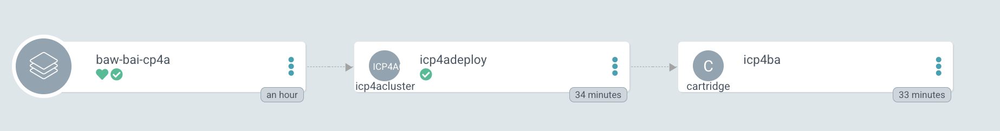

# Digital Business Automation Infrastructure GitOps

This repository is defining different custom resources for Cloud Pak for Business Automation capabilities you want to deploy. 

As a DevOps or Developer, you may want to leverage this GitOps repository for your own solution. 

The Cloud Pak for Automation operators are defined in the [catalog repository](https://github.com/ibm-cloud-architecture/dba-gitops-catalog) and the Cloud Pak for Automation capabilities are defined in this repository.

As some of most automation solutions are using artifacts that are managed in the context of a product (BAW, ODM), then the governance of such artifacts stays within the product, and it is not recommended to adopt a gitops approach for them. 

GitOps approach can still be used to manage common, shared, authoring components, like BAStudio, ODM decision center, and then the different run times.

## Assumptions

We assume you have good understanding of GitOps practices and tools like OpenShift, OpenShift GitOps, and templating like [Kustomize](https://kustomize.io) 

## Specifications

* GitOps repositories should follow the structure prescribed by [Kubernetes Application Manager](https://github.com/redhat-developer/kam)

> KAM's goal is to help creating a GitOps project for an existing application as day 1 operations and then add more services as part of day 2 operation.

* GitOps repositories must contain an Argo CD "Application" resource for each of the Cloud Pak operators, 
which implies that at least the top-level Subscription object for an operator must reside in its own separate folder. 
* GitOps repositories must contain an Argo CD "Application" resource for each of the Cloud Pak capabilities.
* There are several situations where the order of synchronization of resources matters. For example, a 
Subscription resource references a CatalogSource. While the subscription can be applied to a cluster in the
 absence of the CatalogSource, the OLM operator will not process the subscription successfully until it can find 
 the catalog source. Outside of the already supported way to manage dependencies in GitOps, we can use  optional annotations in the resources
which will be used byt [ArgoCD synchronization phases and waves](https://argo-cd.readthedocs.io/en/stable/user-guide/sync-waves/)
* Each Cloud Pak is represented with an "App-of-Apps" Argo Application

## Things to address

Before adopting GitOps for production we need to assess the following:

* Team ownership, where only authorized people can participate as authors, reviewers, and approvers in the git workflow.
he major Git infrastructure providers do not offer access control by folders inside repositories, so this kind of mapping tends to require different repositories.
* Environments, such as development, staging, and production. Many environment differences can be addressed with 
parameters in the resources. That is a preferred approach to reduce replication efforts across folders and minimize 
surprises with slight differences between environments creating blind spots in the progression of changes across 
the pipeline.
* Git Repository granularity: adoptingg the team based ownership may be a good approach. A mono repository for all Cloud Pak may be a valuable solution for demonstration purpose.
* [Kustomize](https://kustomize.io) adoption: Using Kustomize allows the maintainer of a GitOps repository to selectively reference portions of other repositories, either in their literal form or with patched sections
* Secret management approach: from pre-creating secrets in the cluster, use Sealed secrets, or use dynamic secret injection with Vault or [IBM Cloud Key Protect Services](https://www.ibm.com/cloud/key-protect)


## GitOps Bootstrap

### Pre-requisites

* Get last compatible `kubectl` and [oc](https://mirror.openshift.com/pub/openshift-v4/clients/oc/) CLIs

    ```sh
    curl -LO "https://storage.googleapis.com/kubernetes-release/release/$(curl -s https://storage.googleapis.com/kubernetes-release/release/stable.txt)/bin/linux/amd64/kubectl" 
    ```

* Get `podman` CLI or the `docker` CLI.
* Get [jq](https://stedolan.github.io/jq/) tool to help working on json document.
* Clone this repository

    ```sh
    git clone https://github.com/ibm-cloud-architecture/dba-infra-gitops/
    ```

* Login to the OpenShift Console as a cluster administrator, and get login token to be able to use `oc ` command line interface
* Obtain your [IBM license entitlement key](https://github.com/IBM/cloudpak-gitops/blob/main/docs/install.md#obtain-an-entitlement-key) and save it in environment variable named IBM_ENTITLEMENT_KEY

    ```sh
    export IBM_ENTITLEMENT_KEY=...long-key...
    ```

* Define IBM Catalog source:

    ```sh
    ./bootstrap/scripts/installIBMCatalog.sh
    ```

* Get the two storage classes for fast access:  

    > File storage keeps data as a hierarchy of files in folders (`ibmc-file-gold-gid`). Block storage chunks data into organized and evenly sized volumes (used in RWO) ( In ROKS the class is: `ibmc-block-gold-gid`).
    
### Bootstrap

Before getting GitOps running, we need to bootstrap some operators, define the ArgoCD project, and some secrets needed to access remote image registry,...

The following list of steps represent the common actions to do partially manually:

* Modify the `bootstrap.sh` script with your IAM user name.

    ```sh
    # Modify the following script to specify any new product version and your IAM user name and password
    code ./bootstrap.sh
    ```

> IBM deliver tools, scripts, templates ... to define custom resources for the CP4Automation capabilities you want to deploy. To create CR using IBM script, download the [Container Application Software for Enterprises (CASE) repository](https://github.com/IBM/cloud-pak)  which includes a zip file (cert-kubernetes) with configurations and scripts linked to the product version. 

The [dba-gitops-catalog repo](https://github.com/ibm-cloud-architecture/dba-gitops-catalog/) includes operators subscriptions, and the [dba-infra-gitops](https://github.com/ibm-cloud-architecture/dba-infra-gitops) includes boostrap scripts to get this CASE content. 


* Start the bootstrap process to deploy the starter type in the `cp4a` project. The operatos will be in the
`openshift-gitops` and monitor All Namespaces: 

  ```sh
    ./bootstrap.sh
  ```
  
  This script executes IBM `cp4a-clusteradmin-setup.sh` script without any interactive mode. The operation installs the following operators into the `ibm-common-services` namespace:

  

  And the following operators into `openshift-operators` to monitoring all namespaces. 

  

  Once the operators are running the command: `oc get pods -n openshift-gitops` should return a list of pods like:

  ```sh
    NAME                                                        STATUS 
    
    openshift-gitops-application-controller-0                   Running
    openshift-gitops-applicationset-controller-6948bcf87c-jdv2x Running
    openshift-gitops-dex-server-64cbd8d7bd-76czz                Running
    openshift-gitops-redis-7867d74fb4-dssr2                     Running
    openshift-gitops-repo-server-6dc777c845-gdjhr               Running
    openshift-gitops-server-7957cc47d9-cmxvw                    Running
    iaf-core-operator-controller-manager-6bdfc6c9bd-sl8tb       Running
    iaf-eventprocessing-operator-controller-manager-76cd4f8755d Running
    iaf-flink-operator-controller-manager-6c4cc585d9-zdkfn      Running  iaf-insights-engine-operator-controller-manager-cff8d4d5f-6 Running   
    iaf-operator-controller-manager-59c7b8f698-rk2f5            Running
    ibm-common-service-operator-5c59699b56-89rg6                Running
    ibm-cp4a-operator-77d9c86fc-6jqxs                           Running
    ibm-cp4a-wfps-operator-controller-manager-d55d65c8d-4cgxg   Running
    ibm-elastic-operator-controller-manager-55fd78995c-9xxnt    Running
    openshift-pipelines-operator-75587c76cf-qsrkp               Running
  ```


* Create an ArgoCD project (named cp4a-infra) to better isolate the ArgoCD apps management inside Openshift Gitops for this deployment.

    ```sh
    oc apply -k bootstrap/argocd-project 
    ```

  

* Get the ArgoCD `admin` user's password with the command

    ```sh
    oc extract secret/openshift-gitops-cluster -n openshift-gitops --to=-
    ```

* Get the ArgoCD User Interface URL and open a web browser, use admin user and the previous password.

   ```sh
   chrome https://$(oc get route openshift-gitops-server -o jsonpath='{.status.ingress[].host}'  -n openshift-gitops)
   ```

* Update the [OCP global pull secret of the `openshift-operators` project](https://github.com/IBM/cloudpak-gitops/blob/main/docs/install.md#update-the-ocp-global-pull-secret)
with the entitlement key, then create `ibm-entitlement-key` and `admin.registrykey`

  ```sh
    # need that if Operator is set on All namespace
    ./scripts/defineRegistrySecret.sh ibm-entitlement-key openshift-operators
    ./scripts/defineRegistrySecret.sh admin.registrykey openshift-operators
    # need this for each namespace where the product will be installed
    ./scripts/defineRegistrySecret.sh admin.registrykey cp4a
    ./scripts/defineRegistrySecret.sh ibm-entitlement-key cp4a
  ```

* To start the CD management with ArgoCD, just executing the following should work.

  ```sh
  oc apply -k config/argocd
  ```

 The expected set of ArgoCD apps looks like:

 

  and in the details for the BAW / CP for Automation deployment

 

* Get the  `cp4ba-access-info` ConfigMaps for the different URLs to access the deployed capacities.

  ```sh
  oc describe cm icp4adeploy-cp4ba-access-info
  ```

  You should get the CloudPak for Automation UI URL, the `cp4admin` user's password.

### Validation

This is a quick summary of the commands to run to verify the installation. See [product documentation](https://www.ibm.com/docs/en/cloud-paks/cp-biz-automation/21.0.3?topic=scripts-installing-capabilities-by-running-deployment-script) for more details.

* Get Operator logs:

```sh
podname=$(oc get pod -n openshift-operators| grep ibm-cp4a-operator | awk '{print $1}')
oc logs $podname -c operator   -n openshift-operators
```

* Get capabilities deployed abd their status

```sh
oc get ICP4ACluster icp4adeploy -o=jsonpath='{.status.components}' | jq
```

* Get the access information by looking at the access config map or cluster description

```sh
oc describe icp4acluster  icp4adeploy
# With config map
oc describe cm icp4adeploy-cp4ba-access-info 
```

* Login to IBM Cloud Pak Platform UI:

  * To use Enterprise LDAP: use the `cp4admin` user and password coming from the access configmap
  * To use 'IBM provided credentials (admin only); and the OpenShift Admin user with the password from:

  ```sh
  oc -n ibm-common-services get secret platform-auth-idp-credentials -o jsonpath='{.data.admin_password}' | base64 -d
  ```

  > The kubeadmin user in the OpenShift authentication and the IBM provided admin user have the Zen UI administrator role. User can be added.

  * Get the LDAP predefined users

  ```sh
  c get secret icp4adeploy-openldap-customldif -o jsonpath='{.data.ldap_user\.ldif}' | base64 -d
  ```
## Scenarios

### Deploy BAW with BAI in a multitenant namespace 

The goal is to deploy the operators and operands for the dev, qa, staging and production environments 
from the same central GitOps repository. The target deployment looks like in the following diagram:


(src for this diagram: [docs/diagrams/Business_Automation_WorkflowOCP.drawio](https://github.com/ibm-cloud-architecture/dba-gitops-catalog/tree/main/docs/diagrams/BAW_BAI.drawio))

The `openshift-operators` includes all the operators managing resource cross All Namespaces. The listed operators are from Cloud Pak for Automation and represent a subset of the potential operators. Operators deployment depends on the selected products.

As Business Automation has a set of capabilities that use their own IDE and governance, a unique project (green rectangle) is used to deploy such components. Business Automation Studio for example is deployed in the `cp4a` project.

Dev, staging, QA projects are for the different runtime and where the other solution components are deployed. 

Two clusters are represented, the red one is the production cluster, as most likely production solution will be isolated.

One example of custom resource to support a dev deployment is in [the environments/dba-qa/services/baw-bai/base folder](https://github.com/ibm-cloud-architecture/dba-infra-gitops/tree/main/environments/dba-qa/services/baw-bai/base)

The CR is using the following major settings, to deploy BAW and BAI

```yaml
  sc_deployment_patterns: "workflow-workstreams"
  sc_optional_components: "baw_authoring,business_orchestration,workstreams,bai"
```


## Upgrade operator

First start by upgrading IBM common services according to https://github.ibm.com/IBMPrivateCloud/common-services-docs/blob/e6acff94dd47daab4c72df728c62cf76302d70cc/installer/3.x.x/upgrade.md#upgrading-from-version-36x-to-version-37x.


## Add more environment

## Add more service 


## Contributing

Follow the process described [in this note](./docs/CONTRIBUTING.md) to help us improving this content.